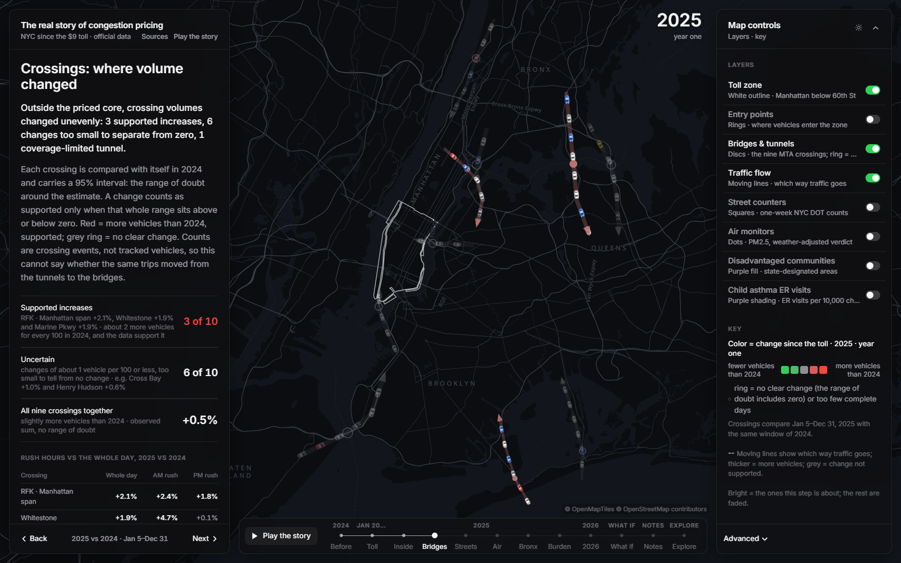

# 🗽 The real story of congestion pricing

When the $9 congestion toll started in Manhattan on January 5, 2025, the headlines were about how much cleaner
and quieter the zone got. I wanted to see what happened everywhere else: on the bridges around the zone, at the
air monitors in the other boroughs, and in the neighborhoods that already had the worst asthma rates.

So I made an interactive map of NYC for the MHC Datathon 2026. It walks through the story one chapter at a time,
and then you can poke around the data yourself. Everything on it comes from public data from the MTA, NYC DOT,
the NYC Health Department and New York State.



## 🚀 Running it

You just need Node.js 22 or newer. The processed data is already in the repo.

```bash
git clone https://github.com/ancel1x/mhc-datathon-2026.git
cd mhc-datathon-2026/frontend
npm install
npm run dev
```

Then open http://localhost:5173.

## 🗺️ The chapters

1. **Before the toll.** What traffic and air looked like in 2024, which is the baseline for everything after.
2. **The headline.** What the toll is, what it costs, and what the official numbers say about the zone itself.
3. **Where did the traffic go?** Which bridges and tunnels got busier or quieter in 2025, including rush hour vs the rest of the day.
4. **Follow the air.** Which air monitors actually got cleaner once you account for weather, and which didn't change.
5. **Who bears the burden?** How those changes line up with neighborhoods the state lists as disadvantaged.
6. **Asthma Alley.** The South Bronx monitors (Mott Haven, Cross Bronx, Hunts Point) looked at one by one.
7. **One year later.** Whether the 2025 patterns held up in January to August 2026.
8. **What could NYC become?** What might happen if a highway like the Major Deegan came down. This one is reasoning from the data, not a prediction.

A few things worth knowing when you use it:

- Click any bridge, monitor or neighborhood to see the numbers behind it.
- Every number has a plain explanation next to it, like "+1.9% means about 2 more vehicles for every 100 in 2024".
- **Play the story** runs a tour with pop-ups on the map. Hit Next or the arrow keys if you don't want to wait.
- After the last chapter the map is yours: pick a year, turn layers on and off, and zoom in for 24-hour clock views.

## 🧰 What it's built with

- **Map:** MapLibre GL (through react-map-gl) with OpenFreeMap tiles and my own dark style. The moving cars are drawn on a separate canvas.
- **Frontend:** React 19 and Vite, plain JavaScript, Recharts and d3 for the charts.
- **Data processing:** Python with pandas, DuckDB (the zone-entry file alone is about 1 GB), shapely and pyproj.
- **Optional API:** FastAPI.
- **Tests:** pytest.

## ⚙️ How it works

1. The Python scripts in `backend/pipeline/` download the public data, crunch it down to per-bridge, per-monitor and per-neighborhood numbers for 2024, 2025 and 2026 so far, and save everything as JSON and GeoJSON.
2. The same data was also analyzed separately, with confidence intervals and weather adjustment. `s07_reconcile.py` adds those results next to mine instead of replacing them. [DATA_RECONCILIATION.md](DATA_RECONCILIATION.md) goes through where the two analyses agreed and where they didn't.
3. The output gets copied into `frontend/public/data/`, which is why the app runs without any of the Python.
4. The app reads those files and builds the chapter text straight from the numbers, so nothing is typed in by hand.

The full write-up of what I found is in [docs/PHASE1_FINDINGS.md](docs/PHASE1_FINDINGS.md).

## 🔬 How I compared things

- **Time periods.** The main comparison is January 5 to December 31, 2024 against the same dates in 2025. I use January to August 2026 only to check whether things stuck. I never treat 2026 as a full year.
- **Traffic.** Vehicles per day at each MTA bridge and tunnel. I only call a change real ("supported") when the whole 95% confidence range is above or below zero.
- **Air.** Hourly PM2.5 from street-level monitors, compared only on months where a monitor has enough data in both years. Each monitor gets a raw change and a weather-adjusted change.
- **Neighborhoods.** Every point is matched to its census tract and neighborhood, so you can see asthma ER rates and poverty next to it.
- **What it can't tell you.** This shows what changed, not why. Traffic counts are cars crossing a bridge, not the same cars being tracked, and a lot of monitors are missing some months.

## 🐍 Rebuilding the data (optional)

You only need this if you want to rerun the analysis. It needs Python 3.12 or newer.

```bash
# Windows
powershell -ExecutionPolicy Bypass -File .\setup.ps1     # one-time setup
powershell -ExecutionPolicy Bypass -File .\dev.ps1       # starts the API and the app

# Mac / Linux
chmod +x setup.sh dev.sh
./setup.sh
./dev.sh
```

- To redo everything: `python backend/pipeline/run_all.py` (using the Python in `.venv`). It downloads about 30 MB.
- To redo just the merge step: `python backend/pipeline/s07_reconcile.py`
- You don't need the two huge raw files (1 GB and 275 MB). Smaller versions of them are already in `data/processed/`.
- Tests: `python -m pytest backend/tests -q`

## 📁 Where things are

```
frontend/                 the app
frontend/public/data/     the data the app reads (about 3 MB)
backend/pipeline/         the Python scripts, s00 to s07
backend/api/              the optional API
backend/tests/            tests
data/processed/           in-between files from the pipeline
data/reference/           the health data and the second analysis
docs/                     findings, file formats, screenshots
```

## 📊 Data sources

| Dataset | From | Where |
|---|---|---|
| Congestion Relief Zone vehicle entries | MTA | NY State Open Data `t6yz-b64h` |
| Bridge and tunnel hourly crossings | MTA | NY State Open Data `ebfx-2m7v` |
| Congestion Relief Zone boundary | MTA | NY State Open Data `srxy-5nxn` |
| Automated traffic volume counts | NYC DOT | NYC Open Data `7ym2-wayt` |
| Street-level PM2.5 monitors (NYCCAS) | NYC Health Dept, Queens College | github.com/nychealth/nyccas-data |
| Yearly neighborhood air quality | NYC Health Dept | NYC Open Data `c3uy-2p5r` |
| Asthma ER visits and poverty by neighborhood | NYC Health Dept | Environment & Health Data Portal |
| Disadvantaged Communities 2023 | NY State | NY State Open Data `2e6c-s6fp` |
| Neighborhood and borough boundaries | NYC Health Dept | github.com/nycehs/NYC_geography |
| Toll rates | MTA | mta.info |

Map tiles by OpenFreeMap, using OpenMapTiles and OpenStreetMap data.
