# Phase 1 findings — "Map the Real Story"

*Updated 2026-09-21 after reconciling two independent analysis pipelines (see `DATA_RECONCILIATION.md`). Numbers
below are the ones the app narrates; `frontend/public/data/summary.json` (including its `reconciled` block) is the
source of truth and is regenerated by `python backend/pipeline/run_all.py`. Data run through Sep 12 2026 for zone
entries, Sep 1 2026 for MTA crossings and Sep 2026 for PM2.5 monitors; the primary comparison is Jan 5–Dec 31,
2024 vs 2025, and the secondary (persistence) comparison is Jan 5–Aug 31 of 2024 / 2025 / 2026.*

## The one-paragraph story

The official topline describes the priced core: a modeled 22% cleaner zone and entries about 11% below a modeled
no-toll baseline (external context, not this project's result). Measured against 2024, the rest of the city is
more mixed. About **502,000 vehicles still entered the zone on an average 2025 weekday**, 77% in the tolled hours,
with the busiest hour still the morning rush; entries fell again in year two (**−4.9% weekday, Jan–Aug 2026 vs
2025**). Around the zone, crossing volumes changed unevenly: **three supported increases** (RFK Manhattan span
+2.1%, Bronx–Whitestone +1.9%, Marine Parkway +1.9%; 95% intervals above zero), **six changes indistinguishable from
zero** (including the Queens Midtown Tunnel, −1.0%) and one coverage-limited tunnel (Hugh L. Carey); the nine
crossings together were +0.5%, an observed sum. The rush hours diverge from the daily totals: the morning rush rose
at Whitestone (+4.7%), Henry Hudson (+4.0%) and the Verrazzano (+1.8%) even where the whole day is uncertain, and
the Queens Midtown evening rush fell (−1.8%). NYC DOT's sampled street counts (23 matched spots, 5 in the same month
of 2024 and 2025, all at the East River bridge approaches and 60th Street, all down) describe their spots only; a
strict matched-month rule yields no citywide street estimate. At the monitors, **seven show a supported
weather-adjusted PM2.5 decrease** (Williamsburg Bridge −2.55 µg/m³, Manhattan Bridge −1.97, Van Wyck −1.40,
Broadway/35th −1.32, Queensboro −1.26, FDR −1.11, Queens College −0.78), **six are uncertain** (Mott Haven,
Cross Bronx, BQE, Midtown West, Staten Island Expressway, and Hamilton Bridge whose raw +2.17 rise does not survive
weather adjustment), none shows a supported increase, and three have no eligible 2024 baseline (Hunts Point,
Glendale, Port Richmond). Only Broadway/35th has all 12 matched months. In the South Bronx the monitor-level evidence
shows no statistically clear increase or decrease at Mott Haven (−0.36, −1.23 to +0.51) or Cross Bronx (−0.65,
−1.71 to +0.41), while Hunts Point lacks a baseline; those neighborhoods carry the highest pre-existing burden
(poverty 35.8% / 33.9%; child asthma ED 266.2 / 258.9 per 10,000 in 2023). The clearest air improvements landed in
and beside the priced core, in neighborhoods with 24–160 child asthma ED visits per 10,000. In Jan–Aug 2026 the
Queens Midtown decline strengthened (−1.7% → −4.7%), Cross Bay reversed (+2.7% → −3.3%), Williamsburg's PM2.5 drop
strengthened and Van Wyck's held; everything else is inconclusive and the year-one increases are no longer
distinguishable from 2024.

## The four questions from the brief, answered

1. **Has congestion pricing reduced pollution and traffic, or has the 22% headline obscured a more mixed daily /
   peak-hour picture?** Mixed. The 22% is a modeled figure against a projected no-toll year (Cornell University,
   *npj Clean Air*, Dec 2025), not a count against 2024. Measured: ~502k weekday entries in 2025, 77% in tolled
   hours, busiest hour 8 AM; three supported crossing increases around the zone and six uncertain changes; morning
   rush increases at Whitestone, Henry Hudson and the Verrazzano where whole days are uncertain; seven supported
   PM2.5 decreases, six uncertain monitors, three without a baseline. (Steps 2, 3, 4, 6.)
2. **Eliminated, or shifted to other parts of the five boroughs, and are those areas vulnerable?** Partly both, and
   the counts cannot say which vehicles moved. Entries into the core fell (official reporting; −4.9% again in year
   two); three surrounding crossings show supported increases and the nine together were +0.5%. One of the three
   (RFK Manhattan span, East Harlem) is in a state Disadvantaged Community. The supported air improvements sit in
   and beside the priced core (lower-burden neighborhoods); the highest-burden monitored neighborhoods show no clear
   change either way. (Steps 4, 8.)
3. **South Bronx / "Asthma Alley", monitor by monitor?** Mott Haven and Cross Bronx are uncertain after weather
   adjustment (both intervals include zero); Hunts Point has no eligible 2024 baseline. Our own control-site reading
   (both lagged the Van Wyck control by ≈ 0.85 µg/m³) carries no interval and is consistent with "no clear change",
   not evidence of harm. Pre-existing burden: Hunts Point–Mott Haven poverty 35.8%, child asthma ED 266.2, adult
   193.5; Crotona–Tremont 33.9%, 258.9, 171.0 (2023; ACS 2019–23). (Step 7.)
4. **What if a major highway like the BQE or Major Deegan were removed or repurposed?** Reasoned, not modeled: one
   corridor, the Major Deegan, labelled "data-grounded scenario reasoning, not a forecast". Existing burden 45,904
   vehicles/day on one counted roadway (post-toll only); feeders RFK Bronx (uncertain) and Henry Hudson (AM rush
   +4.0%, supported); adjacent monitors uncertain, Hamilton Bridge raw rise; asthma ED 259–288 per 10,000 along the
   corridor. Possible benefit: a local exhaust source removed and land freed for greenspace, though exhaust is only
   part of PM2.5. Risk: without trip suppression the same volumes move to Bruckner, the Grand Concourse and Third
   Avenue in the same tracts. No percentage, diversion path or health outcome is stated. (Step 10.)

## 1. The zone and the toll

* Zone: Manhattan south of and including 60th St, excluding the FDR Drive, West Side Highway / Route 9A, the Battery
  Park Underpass and the Hugh L. Carey surface connection. Boundary from MTA's official geofence (`srxy-5nxn`).
* Toll (E-ZPass): cars $9 peak / $2.25 overnight; motorcycles $4.50 / $1.05; small trucks & charter buses
  $14.40 / $3.60; large trucks & tour buses $21.60 / $5.40; taxis $0.75 and app-based FHVs $1.50 per trip.
  Peak = weekdays 5 am–9 pm, weekends 9 am–9 pm. Crossing credits up to $3 (cars) via the four tunnels.

## 2. Inside the zone (MTA zone-entry detectors; no pre-toll baseline)

| Metric | 2025 (Jan 5–Dec 31) | 2026 Jan–Aug | Change |
|---|---|---|---|
| Average weekday entries | 501,867 | 477,855 | −4.9% (vs Jan 5–Aug 31 2025) |
| Peak-window share of entries | 76.5% | 76.1% | |
| Untolled excluded-roadway share (FDR / WSH) | 11.6% | 11.6% | |
| Trucks per day | 19,082 | 18,155 | −7.1% |

Largest entry points (2025 weekdays): East 60th St 15.4%, FDR Drive at 60th 10.3%, Queens Midtown Tunnel 9.1%,
West Side Highway at 60th 9.1%, Lincoln Tunnel 9.0%.

## 3. MTA bridges & tunnels (Jan 5–Dec 31, 2024 vs 2025; 95% intervals from the matched-day analysis)

| Facility | Change | 95% interval | Status | AM rush | PM rush | Jan–Aug 2026 vs 2024 | Persistence |
|---|---|---|---|---|---|---|---|
| RFK Bridge, Manhattan span | +2.1% | +1.1 to +3.2 | supported increase | +2.4% ✓ | +1.8% ✓ | +0.0% (uncertain) | inconclusive |
| Bronx–Whitestone | +1.9% | +1.2 to +2.7 | supported increase | +4.7% ✓ | +0.1% | +0.3% (uncertain) | inconclusive |
| Marine Parkway | +1.9% | +0.2 to +3.4 | supported increase | +2.0% | +1.0% | +0.1% (uncertain) | inconclusive |
| Cross Bay | +1.0% | −0.6 to +2.3 | uncertain | +2.0% | +1.6% | −3.3% ✓ | **reversed** |
| Henry Hudson | +0.6% | −1.2 to +1.8 | uncertain | +4.0% ✓ | −0.2% | −0.7% (uncertain) | inconclusive |
| Verrazzano–Narrows | +0.5% | −0.2 to +1.2 | uncertain | +1.8% ✓ | +0.3% | −0.7% (uncertain) | inconclusive |
| RFK Bridge, Bronx span | +0.4% | −0.5 to +1.1 | uncertain | +0.4% | −0.4% | −1.0% (uncertain) | inconclusive |
| Throgs Neck | +0.4% | −0.2 to +1.1 | uncertain | −0.9% | +2.3% ✓ | +0.1% (uncertain) | inconclusive |
| Queens Midtown Tunnel | −1.0% | −2.4 to +0.5 | uncertain | −0.7% | −1.8% ✓ | −4.7% ✓ | **strengthened** |
| Hugh L. Carey Tunnel | −2.5% all days (−6.1% complete weekends only, −9.1 to −3.4) | — | coverage-limited | −0.3% | −0.7% | −6.1% all days | inconclusive |
| All nine crossings | +0.5% | (observed sum) | — | | | −1.3% | — |

✓ = the window's own 95% interval excludes zero. Counts are crossing events, not tracked vehicles.

## 4. NYC DOT counts (sampled, one-week counts at rotating spots)

23 of 316 mapped locations were counted both before and after the toll. Same calendar month, 2024 → 2025 (the
strongest tier): E 58th St at the Queensboro approach −37.7%, West End Ave at 60th −6.6%, Williamsburg Bridge
approach −4.8% and −2.4%, University Heights Bridge +0.6% (all Oct 2024 → Oct 2025). Two more pairs share a month
with an older baseline and 16 compare different months or years. The independent matched-month analysis found no
eligible repeated street comparison, so there is no citywide street-level change estimate. Post-toll-only counts
exist for the Major Deegan at High Bridge (45,904/day, one roadway, Oct–Nov 2025), the Deegan entrance at the
Willis Ave Bridge (26,108, Dec 2025) and Bruckner Blvd (8,315, Mar 2025).

## 5. NYCCAS monitors (Jan 5–Dec 31, 2024 vs 2025, eligible matched months)

| Monitor | Zone | Months | Raw Δ (95%) | Weather-adjusted Δ (95%) | Class | Jan–Aug persistence |
|---|---|---|---|---|---|---|
| Williamsburg Bridge | inside | 8 / 12 | −1.63 (−2.41 to −0.71) | −2.55 (−3.42 to −1.67) | supported decrease | **strengthened** |
| Manhattan Bridge | inside | 11 / 12 | −1.43 (−2.58 to −0.53) | −1.97 (−2.91 to −1.03) | supported decrease | inconclusive |
| Van Wyck (control) | outside | 8 / 12 | −0.87 (−1.82 to −0.12) | −1.40 (−2.18 to −0.61) | supported decrease | **confirmed** |
| Broadway / 35th St | inside | 12 / 12 | −0.92 (−1.62 to −0.25) | −1.32 (−2.12 to −0.51) | supported decrease | inconclusive |
| Queensboro Bridge | boundary | 10 / 12 | −0.99 (−1.59 to −0.32) | −1.26 (−1.90 to −0.62) | supported decrease | inconclusive |
| FDR Drive | boundary | 9 / 12 | −0.73 (−1.48 to +0.04) | −1.11 (−1.92 to −0.31) | supported decrease | inconclusive |
| Queens College (reference) | outside | 7 / 12 | −0.25 (−0.96 to +0.58) | −0.78 (−1.41 to −0.15) | supported decrease | inconclusive |
| Cross Bronx Expressway | outside | 9 / 12 | −0.19 (−1.31 to +0.78) | −0.65 (−1.71 to +0.41) | uncertain | inconclusive |
| Mott Haven | outside | 9 / 12 | +0.09 (−0.68 to +0.83) | −0.36 (−1.23 to +0.51) | uncertain | inconclusive |
| BQE (Williamsburg) | outside | 5 / 12 | −0.02 (−0.86 to +1.15) | −0.33 (−1.07 to +0.41) | uncertain | inconclusive |
| Midtown West (W 39th) | inside | 5 / 12 | +0.06 (−1.11 to +1.44) | −0.27 (−1.32 to +0.77) | uncertain (moved Jul 2026) | inconclusive |
| Staten Island Expressway | outside | 4 / 12 | +0.62 (−0.80 to +2.28) | +0.86 (−0.55 to +2.26) | uncertain | inconclusive |
| Hamilton Bridge | outside | 5 / 12 | +2.17 (+0.82 to +3.32) | +1.28 (+0.04 to +2.51; BH q = 0.07) | uncertain, raw increase | inconclusive |
| Hunts Point | outside | — | offline Sep 2023 – Mar 2025 | — | no eligible baseline | — |
| Glendale | outside | — | site moved / ended | — | no eligible baseline | — |
| Port Richmond | outside | — | May–Aug 2024 only | — | no eligible baseline | — |

Two adjustments exist and are both shown, never merged: the weather adjustment (regression on a regional weather
proxy with Benjamini–Hochberg correction across monitors; the map class) and our control-site difference (the
monitor's matched-month change minus the Van Wyck control's on shared months; descriptive, no interval).

## 6. Who bears it

* 958 of NYC's 2,167 census tracts (44%, 49% of residents) are state-designated Disadvantaged Communities.
* Of the 3 supported crossing increases, 1 (RFK Manhattan span, East Harlem) is in a DAC tract.
* The 7 supported PM2.5 decreases sit in neighborhoods with 24–160 child asthma ED visits per 10,000 (Upper East Side
  to Union Square–Lower East Side); the uncertain South Bronx monitors sit in Hunts Point–Mott Haven (266) and
  Crotona–Tremont (259); East Harlem (356) is the citywide high and South Beach–Tottenville (23) the low. 2023 is the
  newest year published; historical vulnerability is not a new harm caused by the toll.

## 7. If the Major Deegan came down (data-grounded scenario reasoning, not a forecast)

Observed inputs only: the Deegan at High Bridge carries 45,904 vehicles/day on one counted roadway (post-toll only);
its feeders are the RFK Bronx span (144k/day, +0.4%, uncertain), Henry Hudson (70k, AM rush +4.0% supported),
Whitestone (139k, +1.9% supported) and Throgs Neck (124k, uncertain); the adjacent monitors are uncertain (Mott
Haven, Cross Bronx) or show a raw rise that does not survive weather adjustment (Hamilton Bridge); the corridor's
neighborhoods have 259–288 child asthma ED visits per 10,000, all DAC tracts. Removal or capping would take a local
exhaust source off those blocks and free land for greenspace, but exhaust is only part of PM2.5; without trip
suppression the same volumes would move to Bruckner Boulevard, the Grand Concourse and Third Avenue inside the
same tracts. Year two shows trips can fall when a charge persists (zone entries −4.9%); nothing observed says how
many of the Deegan's would. No diversion share, PM2.5 change or health outcome is stated because none can be supported.
The BQE (129,057/day at Joralemon in May 2025, −10 to −13% vs 2019, beside an uncertain monitor and lower-burden
neighborhoods) stays in Explore.

## 8. Caveats

1. Association is not cause: each place is compared with itself in 2024; other things changed too.
2. Traffic counts are crossing events, not tracked trips.
3. Most monitors have partial matched-month coverage; only Broadway/35th has all 12 months.
4. Hugh L. Carey: complete records for 107 days (2024) and 97 (2025), weekends only; coverage-limited.
5. Hunts Point has no eligible 2024 baseline; Glendale no eligible matched baseline; Midtown West moved 2026-07-23.
6. DOT counts are one-week samples: 23 matched pairs, 5 same-month 2024→2025, no citywide estimate.
7. Zone-entry detectors exist only since the toll; their year-two change is 2026 vs 2025.
8. 2026 is January–August only.
9. All ten sources are official NYC / NY State / NYC DOHMH publications; crossing and gate locations are approximate.

## Screenshots (headless capture of the built app)

| | |
|---|---|
| 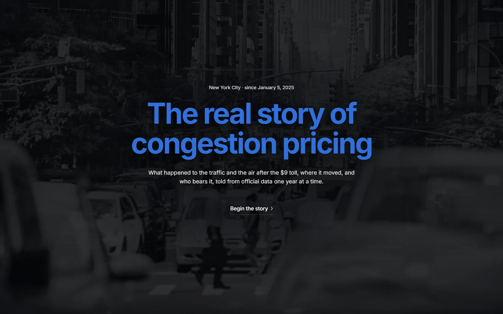 | 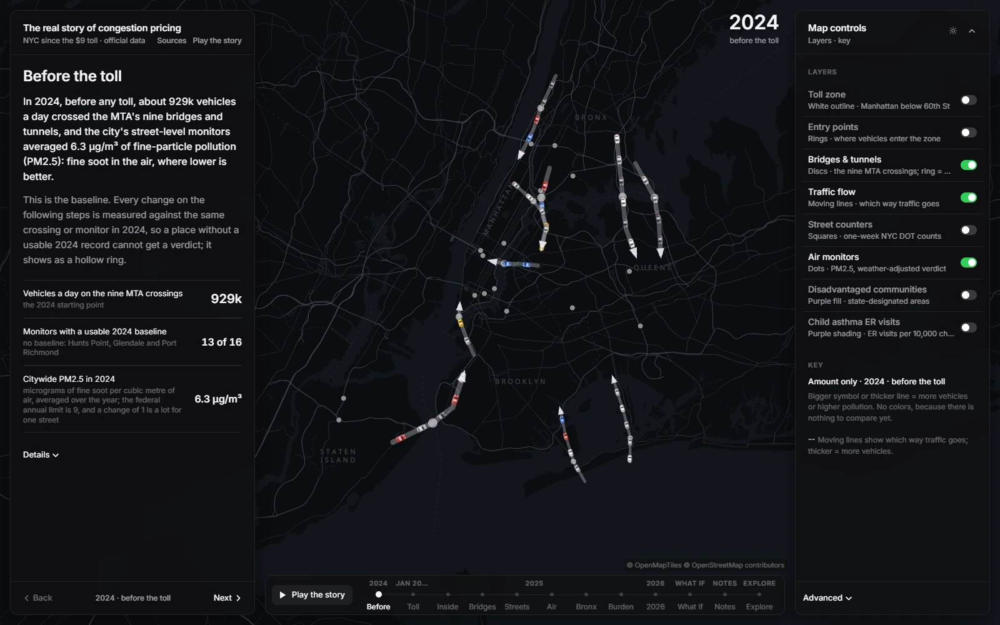 |
| 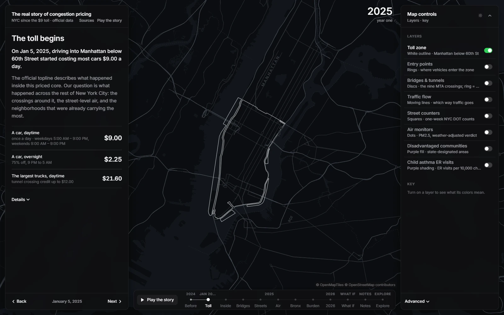 | 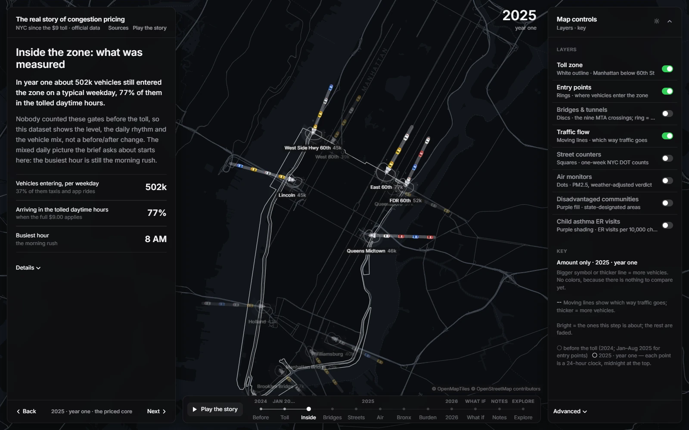 |
| 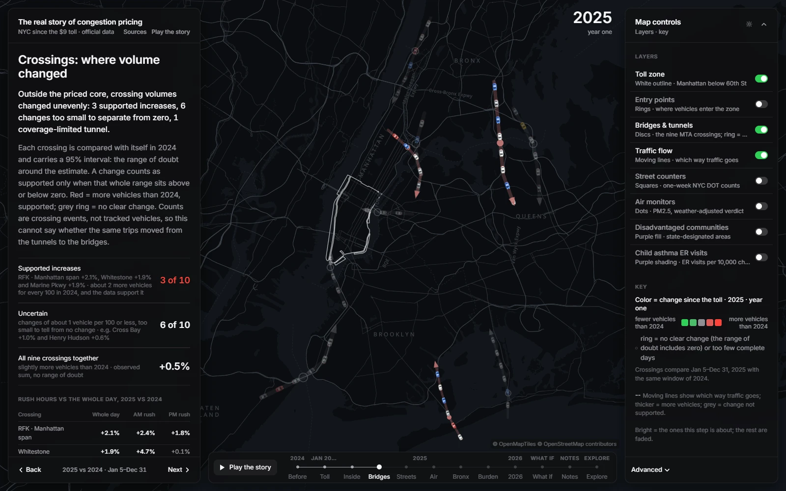 | 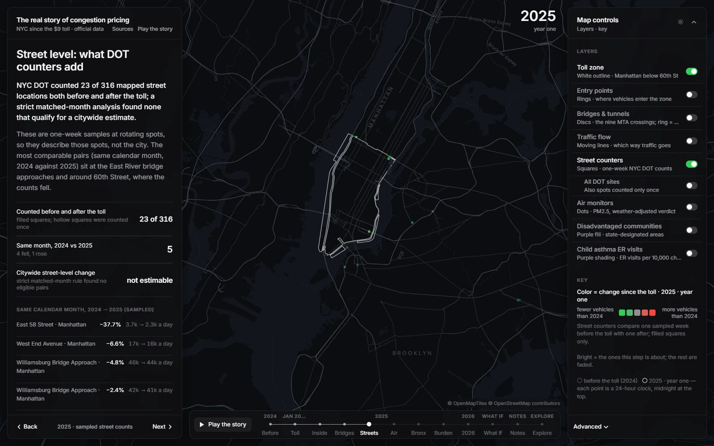 |
| 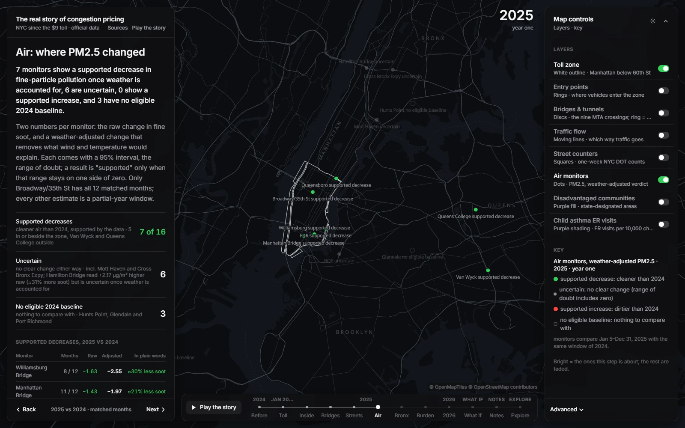 | 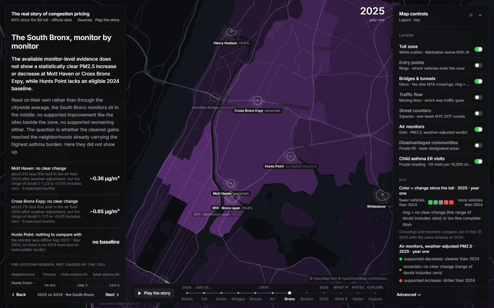 |
| 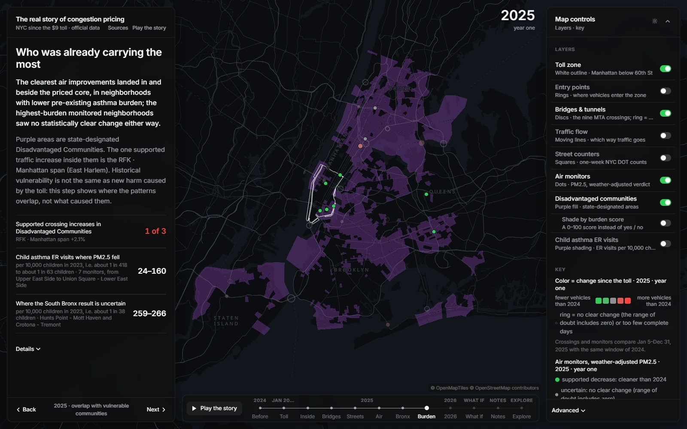 | 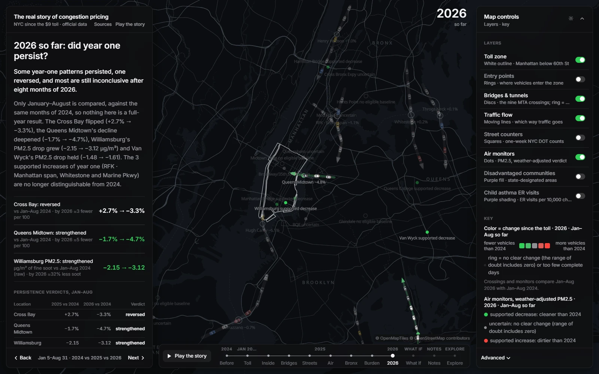 |
| 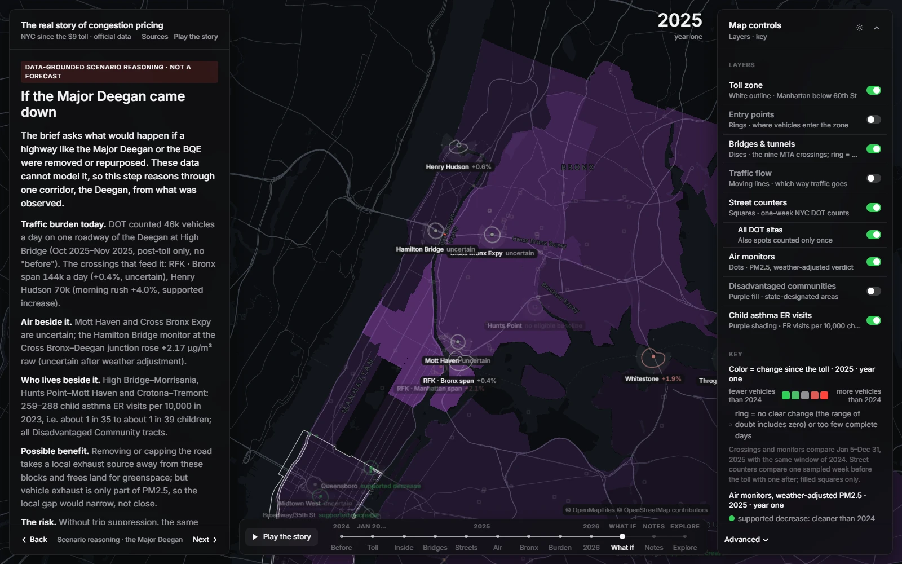 | 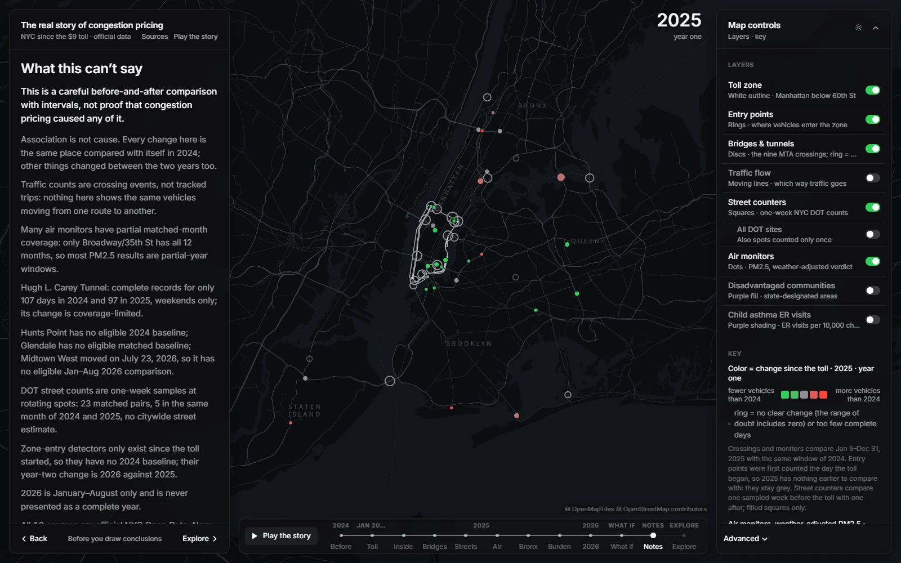 |
| 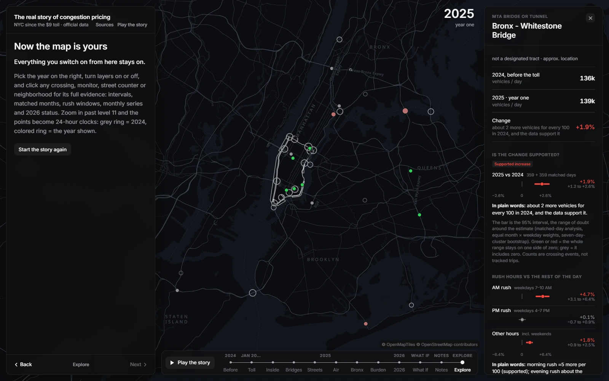 | 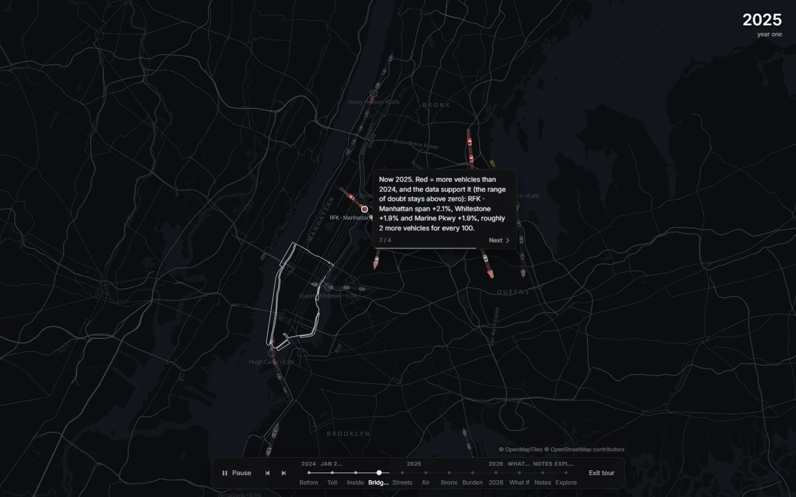 |

The app opens on a title card that fades into the map, then pages along a timeline (Back / Next, arrow keys, or the
stops in the bar under the map). **Play the story** runs the guided tour (Space pauses, Esc exits). Deep links:
`?chapter=1…11`, `?chapter=explore`, `?play=4` (tour from step 4), `?intro=0`, `?feature=bt_facility:whitestone`,
`?feature=aq_monitor:aq_36005NY11534`, `?feature=uhf42:107`, `?theme=light`.
