# Phase 1 findings — "Map the Real Story"

*Generated from the pipeline outputs on 2026-09-20 (data through Sep 12 2026 for zone entries, Sep 1 2026 for MTA
bridges & tunnels, Sep 2026 for PM2.5 monitors). Numbers below are the ones the app narrates; the app's
`summary.json` is the source of truth and is regenerated by `python backend/pipeline/run_all.py`.*

## The one-paragraph story

Congestion pricing did what it was designed to do at the cordon: about **502,000 vehicles entered the zone on an
average weekday in 2025**, and entries kept falling in year two (**−4.9 % weekday, Jan–Aug 2026 vs Jan–Aug 2025**;
trucks **−7.1 %**). Three quarters of entries (76.5 %) happen in the tolled peak window, and about 12 % of vehicles
reaching the 60th Street line use the untolled FDR Drive / West Side Highway. But the region-wide picture is flatter
than the headline: across the nine MTA bridges and tunnels, total crossings were **+0.5 % in 2025 vs 2024** (trucks
**+1.0 %**). The two tunnels that lead into the zone lost traffic (Hugh L. Carey **−2.5 %**, Queens Midtown **−1.0 %**)
while every bridge that lets drivers go *around* Manhattan gained a little — RFK Manhattan span **+2.1 %**,
Bronx-Whitestone **+1.9 %** (trucks **+3.1 %**), Henry Hudson trucks **+4.5 %**, Throgs Neck trucks **+1.6 %** — and
three of the eight facilities that rose sit in state-designated Disadvantaged Community tracts. Street-level air
monitors tell the same two-speed story: the two bridge-approach monitors inside the zone **genuinely improved**
(Manhattan Bridge −1.4 µg/m³, Williamsburg Bridge −1.6 µg/m³, both beyond the control site's decline), the rest of
the inside-zone sites simply tracked the citywide improvement, the South Bronx monitors **did not improve at all**
(Mott Haven 7.6 → 7.6 µg/m³ and Cross Bronx 9.3 → 9.0 while the control site fell 0.9 — i.e. they lagged the region
by ~0.85 µg/m³), and two outside sites rose (Hamilton Bridge / Cross Bronx approach **+2.3 µg/m³**, Staten Island
Expressway **+0.9 µg/m³**). Both South Bronx sites sit in neighborhoods with among the city's highest child asthma
emergency-visit rates (Hunts Point–Mott Haven 266 and Crotona–Tremont 259 visits per 10,000 children ages 5–17 in 2023;
East Harlem, at 356, is the highest; South Beach–Tottenville, at 23, the lowest). Health data lag about two years, so
2023 is the newest year published and there are no post-toll asthma figures yet: this is the pre-existing burden, not an effect.

## The four questions from the brief, answered

1. **Has congestion pricing actually reduced air pollution and vehicle traffic, or has the 22 % headline obscured a
   more mixed daily / peak-hour picture?** Mixed. At the cordon about 502,000 vehicles still entered on an average
   2025 weekday, 76.5 % of them in the tolled peak window and 11.6 % on the untolled FDR / West Side Highway; the
   busiest hour is the morning rush. The 22 % figure is a modeled drop in daily-maximum PM2.5 inside the zone against a
   projected no-toll year (Cornell University, *npj Clean Air*, Dec 2025), not a measured change against 2024. Measured
   against what the rest of the city did, only the two bridge-approach monitors inside the zone beat the citywide trend,
   by ≈ 0.8 µg/m³; the other four tracked it. Traffic did fall in year two: weekday entries −4.9 % and trucks −7.1 %
   vs the same months of 2025, and the nine MTA crossings −1.3 % vs Jan–Aug 2024. (App steps 3, 5, 7.)
2. **Is pollution and traffic being eliminated, or shifted to other parts of the five boroughs? Are those areas
   already historically vulnerable, high-asthma or environmental-justice communities?** Shifted, in year one. The two
   tunnels into the zone lost traffic (−2.5 %, −1.0 %) while all eight bridges around it gained (+0.4 to +2.1 %,
   trucks up to +4.5 %), and the nine crossings together were +0.5 %. Three of the eight busier bridges (both RFK
   spans, Throgs Neck) and both South Bronx monitors that stood still are in state-designated Disadvantaged Community
   tracts; the worsened monitor in a DAC tract is the Hamilton Bridge / Cross Bronx approach (+2.3 µg/m³). (Steps 4, 6.)
3. **If traffic is diverting into the South Bronx, what does that mean for "Asthma Alley", and what do the
   monitor-level data actually show, separate from the citywide average?** The monitor-level data say the South Bronx
   did not share in the improvement: Mott Haven 7.6 → 7.6 µg/m³ and Cross Bronx 9.3 → 9.0 while the control site fell
   0.9, so both lagged the city by ≈ 0.85 µg/m³ (not statistically significant on one year of data). They sit in
   Hunts Point–Mott Haven (266) and Crotona–Tremont (259 child asthma ER visits per 10,000, 2023), among the six
   highest of 42 neighborhoods. Whether traffic diverted onto the Deegan, Bruckner or Cross Bronx cannot be measured
   directly: the zone-entry data do not cover Bronx roadways and DOT has only post-toll counts there, so diversion is
   inferred from the Bronx bridges (+0.4 to +1.9 %, trucks +1.6 to +4.5 %) and the Alexander Hamilton Bridge count
   (+22 % on one roadway). (Step 5.)
4. **What would happen to traffic, air quality and equity if a major highway segment like the BQE or the Major
   Deegan were removed or repurposed?** Reasoned from the data, not modeled (section 6 below). Year one shows the
   mechanism: when a route got costlier, traffic went around it, not away. Removal without a charge would push the
   Deegan's ≈ 46,000 vehicles a day (one counted roadway) and the BQE's ≈ 129,000 at Joralemon Street onto parallel
   streets in the same Disadvantaged Community tracts and high-asthma neighborhoods; removal with a persistent charge
   would follow the year-two pattern, where trips disappear. (Step 8.)

## 1. The zone and the toll

* Zone: Manhattan south of and including 60th St, excluding the FDR Drive, West Side Highway/Route 9A, the Battery
  Park Underpass and the Hugh L. Carey surface connection. Boundary from MTA's official geofence.
* Toll (E-ZPass): cars $9 peak / $2.25 overnight; motorcycles $4.50 / $1.05; small trucks & charter buses
  $14.40 / $3.60; large trucks & tour buses $21.60 / $5.40; taxis $0.75 and app-based FHVs $1.50 per trip.
  Peak = weekdays 5 am–9 pm, weekends 9 am–9 pm. Crossing credits up to $3 (cars) via the four tunnels.
  Scheduled increases: $12 in 2028, $15 in 2031.

## 2. Who enters, and when (MTA zone-entry detectors)

| Metric | 2025 (Jan 5–Dec 31) | 2026 Jan–Aug | Change |
|---|---|---|---|
| Average weekday entries | 501,867 | 477,855 | −4.9 % (vs Jan 5–Aug 31 2025) |
| Average weekend-day entries | 473,026 | 451,173 | |
| Peak-window share of entries | 76.5 % | 76.1 % | |
| Untolled excluded-roadway share (FDR/WSH) | 11.6 % | 11.6 % | |
| Trucks per day | 19,082 | 18,155 | −7.1 % |

Largest entry points (2025 weekdays): East 60th St 15.4 %, FDR Drive at 60th 10.3 %, Queens Midtown Tunnel 9.1 %,
West Side Highway at 60th 9.1 %, Lincoln Tunnel 9.0 %. The map's clock glyphs show each crossing's weekday hour-of-day
profile in 2025 (grey ring) vs 2026 (colored ring): the decline is concentrated in the daytime peak.

*Caveat:* these detectors only exist since Jan 5 2025, so this dataset cannot show "before"; MTA's own baseline is a
model, not a count. The "22 %" headline comes from a Cornell University study
([npj Clean Air, Dec 2025](https://news.cornell.edu/stories/2025/12/congestion-pricing-improved-air-quality-nyc-and-suburbs)):
a modeled 22 % (−3.05 µg/m³) drop in daily-maximum PM2.5 inside the zone for Jan–Jun 2025 against a projected no-toll
level of 13.8 µg/m³, alongside an 11 % drop in entries against MTA's modeled baseline. Neither is a count against 2024;
the comparisons in this document are.

## 3. Where the traffic moved (MTA Bridges & Tunnels + NYC DOT counts)

System-wide (9 tolled MTA crossings): 929,483 vehicles/day in 2024 → 934,058 in 2025 (**+0.5 %**); Jan–Aug 2026 is
**−1.3 %** vs Jan–Aug 2024. Trucks +1.0 % in 2025, −1.3 % in 2026 YTD.

| Facility | 2025 vs 2024 | Trucks | In DAC tract | Reading |
|---|---|---|---|---|
| RFK Bridge, Manhattan span | +2.1 % | −0.8 % | yes | around-Manhattan route via East Harlem |
| Bronx-Whitestone | +1.9 % | +3.1 % | no | Bronx–Queens bypass |
| Marine Parkway | +1.9 % | −3.5 % | no | Rockaways (quasi-control) |
| Cross Bay | +1.0 % | +4.7 % | no | Rockaways (quasi-control) |
| Henry Hudson | +0.6 % | +4.5 % | no | Bronx–Manhattan north |
| Verrazzano-Narrows | +0.5 % | −0.9 % | no | Staten Island–Brooklyn / Gowanus-BQE |
| RFK Bridge, Bronx span | +0.4 % | +0.4 % | yes | Mott Haven / Port Morris approach |
| Throgs Neck | +0.4 % | +1.6 % | yes | Bronx–Queens bypass |
| Queens Midtown Tunnel | −1.0 % | +5.6 % | no | into the zone |
| Hugh L. Carey Tunnel | −2.5 % | −3.6 % | no | into the zone |

Reading: traffic did not vanish; it thinned slightly at the cordon and thickened slightly on the routes around it,
with trucks shifting more than cars on the Bronx–Queens crossings. The quasi-control Rockaway bridges also rose
~1–2 %, so part of the outer-bridge increase is general growth rather than diversion.

DOT automated counts (spot samples): 23 locations were counted both before and after the toll (7 with the same
calendar month). 17 fell, 6 rose. Highlights: Queensboro Bridge Manhattan roadway −26 % (Oct 2023 → Nov 2025),
E 58th St Queensboro approach −38 % (Oct 2024 → Oct 2025), Adams St / Brooklyn Bridge approach −31 % (Nov 2024 →
May–Jun 2025), Williamsburg Bridge approach −2 to −5 % (Oct 2024 → Oct 2025), West End Ave at 60th −7 %,
Brooklyn Bridge −1 % (vs Oct 2022), BQE at Joralemon −10 to −13 % (vs Oct–Nov 2019), University Heights Bridge +0.6 %,
Alexander Hamilton Bridge (Cross Bronx approach) +22 % on one roadway and +1 % on the other (Oct 2023 → Nov 2025).
Post-toll-only snapshots exist for the Major Deegan (Oct–Nov 2025), Bruckner Blvd (Mar 2025) and Mott Haven streets
(Apr 2025) but have no pre-toll count to compare against.

## 4. What the monitors say (NYCCAS real-time PM2.5, 2024 vs 2025, matched months, smoke days excluded)

Method: daily means from hourly readings; months used only when both years have ≥ 60 % coverage; change compared with
DOHMH's control site (Van Wyck Expressway, −0.91 µg/m³) on the same months; 95 % bootstrap interval on the raw change.

| Site | Zone | 2024 → 2025 (µg/m³) | Raw Δ | Δ vs control | Verdict |
|---|---|---|---|---|---|
| Manhattan Bridge (Canal St) | inside | 9.20 → 7.82 | −1.38 | −0.79 | **improved** |
| Williamsburg Bridge (Delancey) | inside | 8.42 → 6.81 | −1.60 | −0.78 | **improved** |
| Broadway / 35th St | inside | 8.91 → 8.01 | −0.91 | −0.10 | unchanged (tracked control) |
| Midtown (W 39th St) | inside | 9.13 → 9.55 | +0.42 | +0.45 | unchanged (4 months) |
| FDR Drive (E 6th–10th) | boundary | 7.48 → 6.70 | −0.78 | −0.04 | unchanged (tracked control) |
| Queensboro Bridge (60th St) | boundary | 7.52 → 6.57 | −0.95 | −0.16 | unchanged (tracked control) |
| **Mott Haven (E 135th St)** | outside | 7.61 → 7.59 | −0.02 | **+0.85** | unchanged — lagged control |
| **Cross Bronx Expressway** | outside | 9.26 → 9.02 | −0.24 | **+0.87** | unchanged — lagged control |
| BQE (Williamsburg) | outside | 5.45 → 5.61 | +0.16 | +0.15 | unchanged (4 months) |
| Hamilton Bridge (W 178th) | outside | 6.90 → 9.15 | **+2.25** | +2.10 | **worsened** (5 months; CI +1.2 to +3.4) |
| Staten Island Expressway | outside | 7.11 → 8.00 | +0.89 | +1.12 | **worsened** (4 months; CI crosses 0) |
| Queens College (reference) | outside | 6.44 → 6.00 | −0.44 | +0.80 | unchanged |
| Van Wyck (control) | outside | 7.25 → 6.34 | −0.91 | — | improved |
| Hunts Point | outside | offline Sep 2023–Mar 2025 | — | — | no pre-toll baseline; 2026 vs 2025 (Mar–Aug): 8.53 → 7.99 |
| Glendale, Port Richmond | outside | site moved / ended | — | — | insufficient |

Inside the zone: 2 improved, 4 unchanged, 0 worsened. Outside: 1 improved (the control itself), 4 unchanged,
2 worsened, 3 insufficient. Both South Bronx monitors and the Hamilton Bridge monitor are in Disadvantaged Community
tracts. The citywide NYCCAS annual average fell from 10.4 µg/m³ (2009) to 6.3 µg/m³ (2024) — the long-run decline
that the control adjustment is meant to net out.

## 5. Who bears it

* 958 of NYC's 2,167 census tracts (44 %, 49 % of residents) are state-designated Disadvantaged Communities.
* Of the 8 MTA facilities whose traffic rose in 2025, 3 are in DAC tracts (both RFK spans and Throgs Neck).
* Of the 2 monitors that worsened, 1 is in a DAC tract (Hamilton Bridge, Washington Heights); both South Bronx
  monitors that lagged the regional improvement are in the Hunts Point–Mott Haven and Crotona–Tremont neighborhoods,
  which have among the city's highest child asthma emergency-visit rates (266 and 259 per 10,000 children ages 5–17
  in 2023; the citywide range runs from 23 in South Beach–Tottenville to 356 in East Harlem). 2023 is the newest year
  published (health data lag about two years), so no post-toll asthma data exist; the older PM2.5-attributable
  estimate (2017–2019) ranks the same neighborhoods at the top and is kept in the data for reference.

## 6. If the Major Deegan or the BQE came down (reasoned from the data, not modeled)

The brief asks what would happen to traffic, air quality and equity if a major highway segment were removed or
repurposed, and to reason through it with data where a model is not possible. None of these sources record trip
origins and destinations, so this is reasoning from the counts, not a model.

* **What the roads carry.** DOT counted the Major Deegan at High Bridge at 45,904 vehicles/day on one roadway
  (Oct–Nov 2025, post-toll only, no baseline), the northbound Deegan entrance at the Willis Avenue Bridge at 26,108
  (Dec 2025) and Bruckner Boulevard at 8,315 (Mar 2025). The BQE at Joralemon Street carried 63,346 + 65,711 =
  129,057 vehicles/day in May 2025 (−12.6 % and −10.0 % vs Oct–Nov 2019); the Kosciuszko Bridge 102,143 + 91,941.
* **What feeds them.** The RFK Bronx span (144,256/day, +0.4 %, DAC tract), Henry Hudson (69,556, trucks +4.5 %),
  Whitestone (139,123, +1.9 %) and Throgs Neck (124,151, DAC tract) feed the Deegan / Cross Bronx system; the
  Verrazzano (222,609/day, +0.5 %) feeds the Gowanus / BQE. All of them got busier in year one, and the Alexander
  Hamilton Bridge, where the Cross Bronx meets the Deegan, rose +22 % on one roadway (Oct 2023 → Nov 2025).
* **Traffic.** Year one is the natural experiment: a costlier route (the tolled tunnels, −1 to −2.5 %) sent traffic
  around (every bridge +0.4 to +2.1 %) while the system total stayed flat (+0.5 %). A removed highway with no charge
  is the same mechanism at larger scale: the Deegan's trips would move to Bruckner Boulevard, the Grand Concourse and
  Third Avenue; the BQE's to Third and Atlantic Avenues and the local grid. Year two shows the other path: when a charge
  persists, trips do disappear (weekday entries −4.9 %, trucks −7.1 %, nine crossings −1.3 % vs 2024).
* **Air.** The monitors beside these roads are the ones that did not follow the citywide decline: Cross Bronx 9.0 µg/m³
  and Mott Haven 7.6 (citywide 2024 average 6.3), lagging the control by ≈ 0.85; the BQE monitor in Williamsburg
  (5.6) tracked the trend. Removing the road removes the local source, but vehicle exhaust is a minority share of PM2.5,
  so the local excess would narrow rather than close, and traffic diverted onto surface streets sits beside homes and
  schools rather than on the highway.
* **Equity.** The Deegan corridor runs through High Bridge–Morrisania (288), Hunts Point–Mott Haven (266) and
  Crotona–Tremont (259 child asthma ER visits per 10,000, 2023), the third-, fourth- and sixth-highest of 42
  neighborhoods, all Disadvantaged Community tracts. The BQE's Brooklyn corridor is lower (Greenpoint 49,
  Downtown–Heights–Slope 114, Williamsburg–Bushwick 159, Sunset Park 87), so the equity stakes of a Deegan removal are
  higher. Either way, the benefit lands on these neighborhoods only if trips are suppressed; if they are merely diverted,
  the burden moves a few blocks, onto streets in the same tracts.

## 7. Caveats

1. The zone-entry dataset has no pre-toll baseline and does not directly measure South Bronx roadways.
2. DOT counts are short samples at rotating locations; several baselines are a different month or year.
3. PM2.5 is driven mostly by weather, heating, cooking and regional smoke; vehicle traffic is a minority source. The
   comparison uses a control site and excludes regional smoke days but does not model wind/temperature. Several
   monitors were installed in 2024, so their baselines are 4–8 months long.
4. Gantry and facility coordinates are approximate; DOT count points are exact.
5. All inputs are official NYC Open Data / NY State Open Data / NYC DOHMH publications (see README).

## Screenshots (headless capture of the built app)

| | |
|---|---|
| 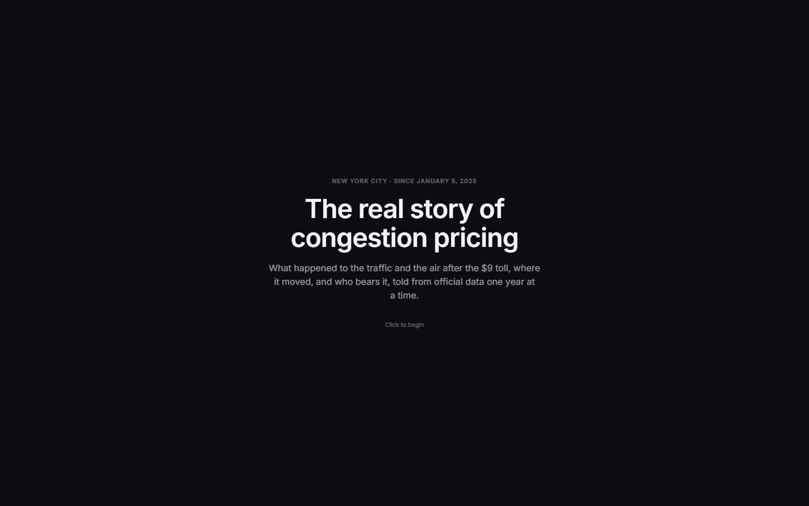 | 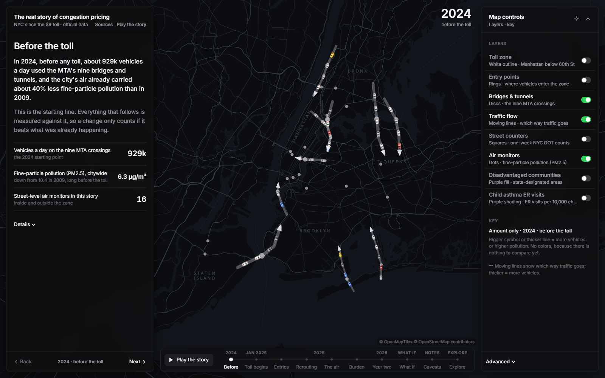 |
| 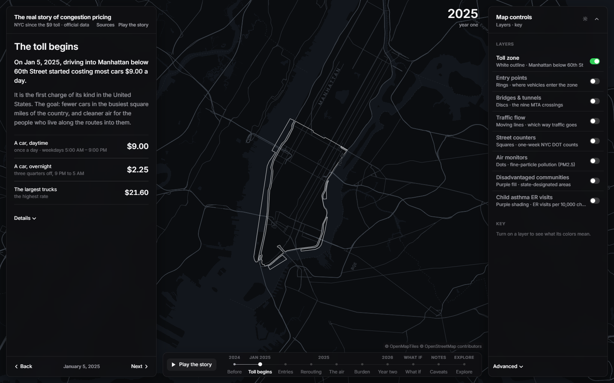 | 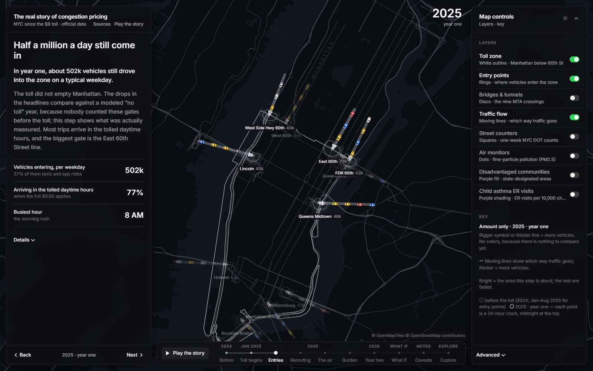 |
| 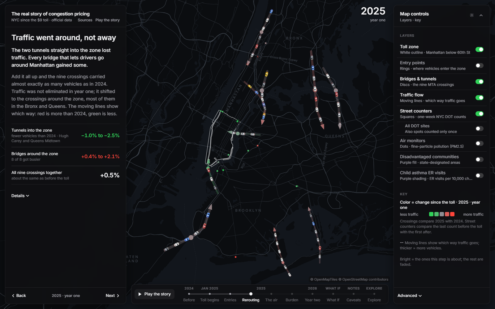 | 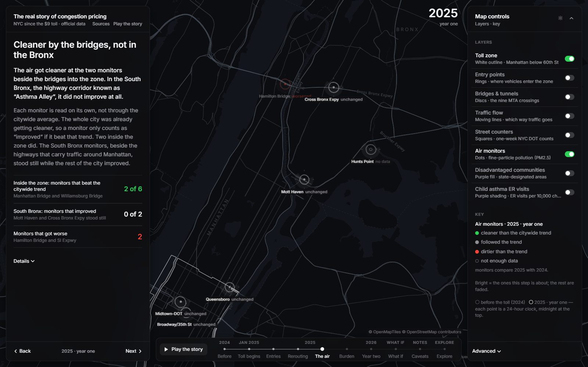 |
| 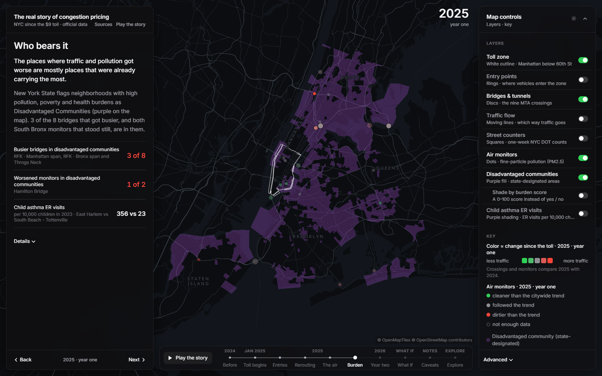 | 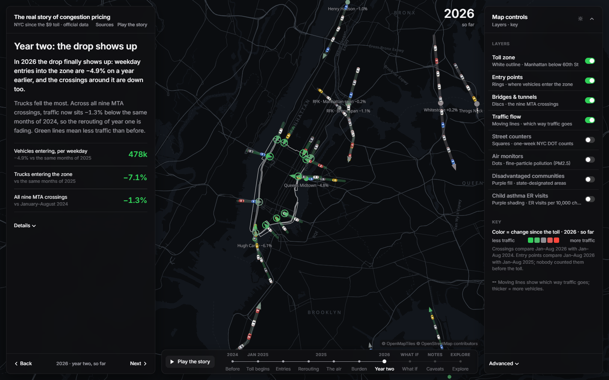 |
| 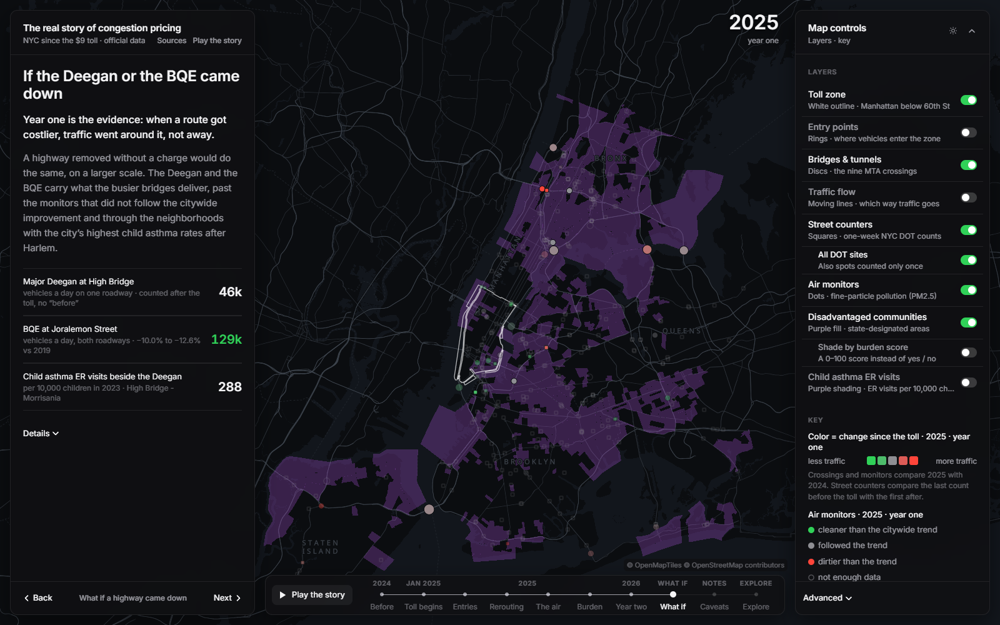 | 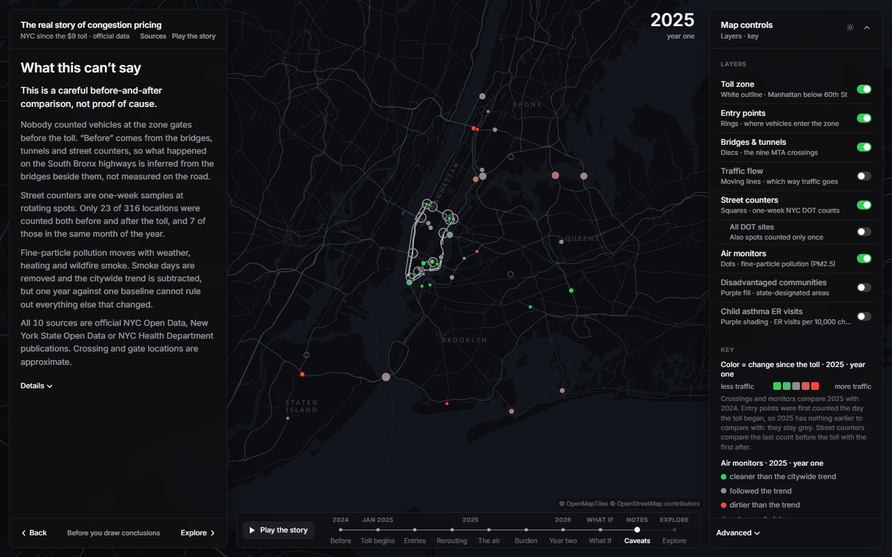 |
| 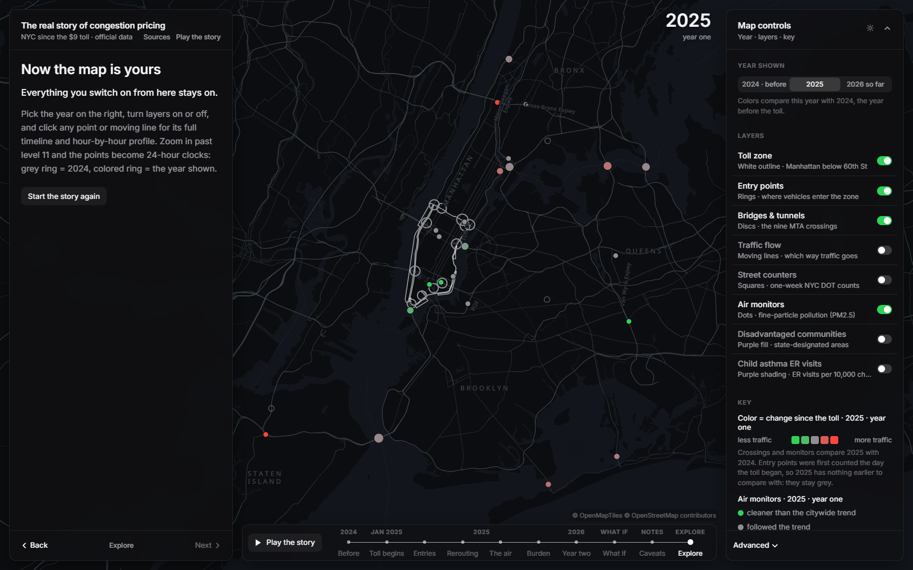 | 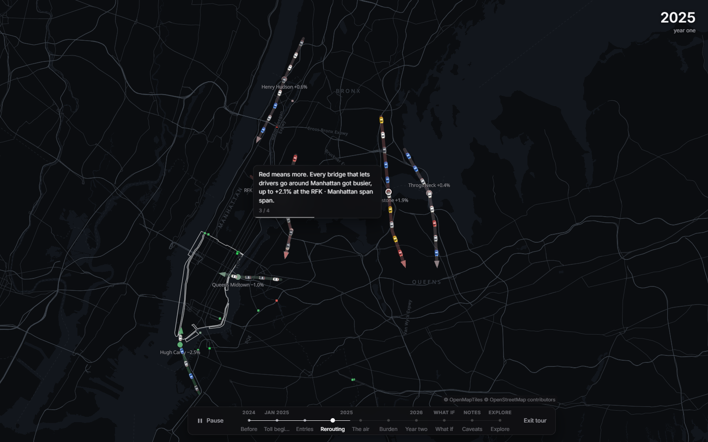 |

The app opens on a title card that fades into the map, then pages along a timeline (Back / Next, arrow keys, or the
stops in the bar under the map). **Play the story** runs the guided tour (Space pauses, Esc exits). Deep links:
`?chapter=1…9`, `?chapter=explore`, `?play=4` (tour from step 4), `?intro=0`, `?feature=bt_facility:whitestone`, `?theme=light`.
